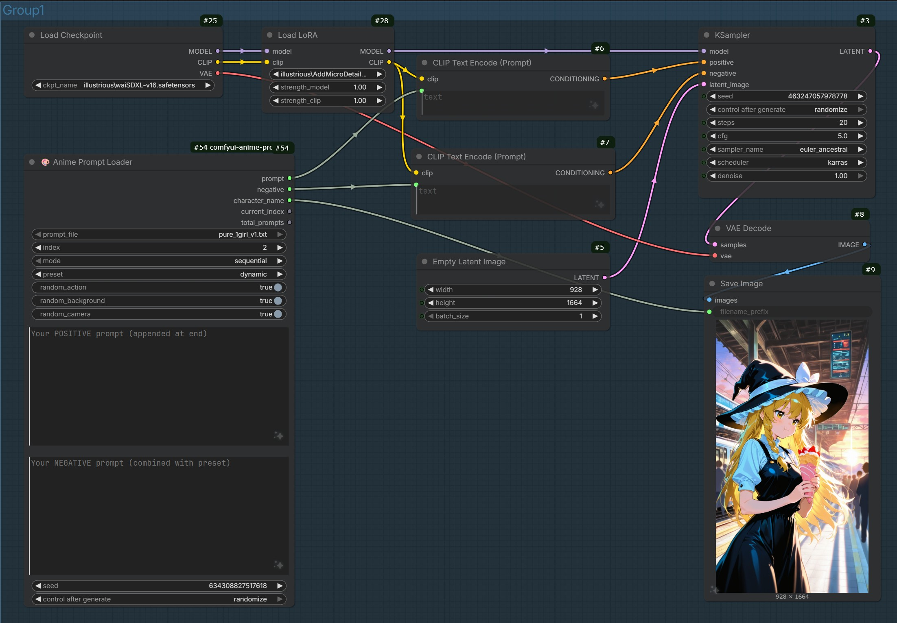
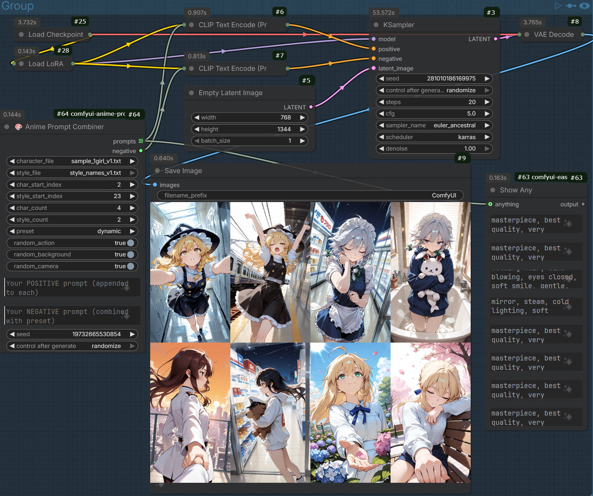

# 🎨 Anime Prompt Loader for ComfyUI

[](https://github.com/jluo-github/comfyui-anime-prompts/actions/workflows/lint.yml)
[](https://opensource.org/licenses/MIT)
[](https://www.python.org/downloads/)

Custom ComfyUI nodes for loading anime character prompts with **dynamic generation** — automatic actions, backgrounds, and camera effects. Optimized for Illustrious-XL.

## ✨ Features

- **Dynamic Prompt Formula**: Quality Tags + Character + Action + Background + Camera
- **Style Presets**: 7 curated styles with matching negative prompts
- **Random Generation**: 21 actions, 14 backgrounds, 8 camera effects
- **Batch Processing**: Generate multiple unique prompts at once
- **Character + Style Combiner**: Combine characters with styles in nested loops

## Installation

```bash
git clone https://github.com/jluo-github/comfyui-anime-prompts.git ComfyUI/custom_nodes/comfyui-anime-prompts
```

A sample file (`sample_1girl_v1.txt`) with 100 anime characters is included for testing.

1. (Optional) Add your own TXT files to the plugin directory
2. Restart ComfyUI

## 📸 Workflow Examples

### Single Prompt Workflow

Use **Anime Prompt Loader** for single image generation with dynamic elements.



📥 **Download**: [anime_prompts_workflow.json](anime_prompts_workflow.json)

---

### Batch Prompt Workflow

Use **Anime Prompt Batch** for generating multiple unique images at once.


📥 **Download**: [anime_prompts_batch_workflow.json](anime_prompts_batch_workflow.json)

---

### Combiner Workflow

Use **Anime Prompt Combiner** to combine characters from one file with styles from another.



📥 **Download**: [anime_prompts_combiner_workflow.json](anime_prompts_combiner_workflow.json)

---

## Nodes

### 🎨 Anime Prompt Loader

Loads a single prompt with dynamic generation.

| Input | Type | Description |
|-------|------|-------------|
| `prompt_file` | dropdown | Select from available TXT files |
| `index` | int | Prompt index (sequential mode) |
| `mode` | dropdown | `sequential` or `random` |
| `preset` | dropdown | Style preset (see presets below) |
| `random_action` | bool | Add random action/pose |
| `random_background` | bool | Add random background |
| `random_camera` | bool | Add random camera effects |
| `custom_positive` | string | Your additional positive tags |
| `custom_negative` | string | Your additional negative tags |
| `seed` | int | Random seed for reproducibility |

| Output | Type | Description |
|--------|------|-------------|
| `prompt` | string | Complete positive prompt |
| `negative` | string | Combined negative prompt |
| `character_name` | string | Character name from TXT |
| `current_index` | int | Selected prompt index |
| `total_prompts` | int | Total prompts in file |

---

### 🎨 Anime Prompt Batch

Outputs multiple unique prompts for batch generation.

| Input | Type | Description |
|-------|------|-------------|
| `prompt_file` | dropdown | Select from available TXT files |
| `start_index` | int | Starting index for batch |
| `batch_size` | int | Number of prompts to output |
| `preset` | dropdown | Style preset |
| `random_action` | bool | Add random actions (unique per batch) |
| `random_background` | bool | Add random backgrounds (unique per batch) |
| `random_camera` | bool | Add random camera effects (unique per batch) |
| `custom_positive` | string | Your additional positive tags |
| `custom_negative` | string | Your additional negative tags |
| `seed` | int | Random seed |

| Output | Type | Description |
|--------|------|-------------|
| `prompts` | list[string] | List of unique prompt strings |
| `negative` | string | Combined negative prompt |

---

### 🎨 Anime Prompt Combiner

Combines characters with styles using nested loops.

| Input | Type | Description |
|-------|------|-------------|
| `character_file` | dropdown | TXT file with character prompts |
| `style_file` | dropdown | TXT file with style prompts |
| `char_start_index` | int | Starting index for characters |
| `style_start_index` | int | Starting index for styles |
| `char_count` | int | Number of characters to use |
| `style_count` | int | Number of styles per character |
| `preset` | dropdown | Style preset |
| `random_action` | bool | Add random actions |
| `random_background` | bool | Add random backgrounds |
| `random_camera` | bool | Add random camera effects |
| `custom_positive` | string | Your additional positive tags |
| `custom_negative` | string | Your additional negative tags |
| `seed` | int | Random seed |

| Output | Type | Description |
|--------|------|-------------|
| `prompts` | list[string] | Combined prompts (char_count × style_count) |
| `negative` | string | Combined negative prompt |

---

### ✨ Suffix Editor

Preview and customize style presets.

| Input | Type | Description |
|-------|------|-------------|
| `preset` | dropdown | Select style preset |
| `use_custom` | bool | Override preset with custom values |
| `custom_suffix` | string | Custom positive suffix |
| `custom_negative` | string | Custom negative prompt |

| Output | Type | Description |
|--------|------|-------------|
| `suffix` | string | Positive suffix string |
| `negative` | string | Negative prompt string |

## Style Presets

| Preset | Description |
|--------|-------------|
| `none` | Raw output, no quality tags |
| `standard` | Default Illustrious-XL quality tags |
| `dynamic` | Action shots with motion blur and wind |
| `atmospheric` | Cinematic lighting, depth of field, soft focus |
| `flat` | Vibrant colors, vector style, bold lines |
| `dreamy` | Pastel colors, soft lighting, ethereal atmosphere |
| `gothic` | Dark theme with high contrast shadows |

Each preset includes a **matching negative prompt** automatically applied.

## TXT Format

Tab-separated format (one per line):

```
tags<TAB>character_name
```

Example:
```
hatsune miku,vocaloid,1girl,aqua eyes,blue hair,twintails	初音未来
hakurei reimu,touhou,1girl,brown hair,red eyes,hair bow	博丽灵梦
```

## Dynamic Generation

When enabled, these elements are **randomly added** to each prompt:

### Actions (21)
- Cute eating: toast, crepe, bubble tea, ice cream
- Girly poses: peace sign, twirling, finger on lips
- Emotional: crying, hugging knees, lonely
- Soft/dreamy: reaching for petals, holding flower
- Cozy: sleeping, hugging plushie, holding cat

### Backgrounds (14)
- Libraries, cyberpunk streets, fantasy forests
- Beaches, cathedrals, rooftops, underwater scenes
- Modern interiors: apartments, cafes, classrooms

### Camera Effects (8)
- Angles: from above, from below, dutch angle
- Lighting: cinematic, backlight, rim light
- Shots: close-up, wide shot, silhouette

## Development

```bash
# Install dev dependencies
pip install ruff pytest

# Run linting
ruff check .

# Run tests
pytest tests/ -v
```

## License

[MIT License](LICENSE)

---

Made with ❤️ for the ComfyUI community
